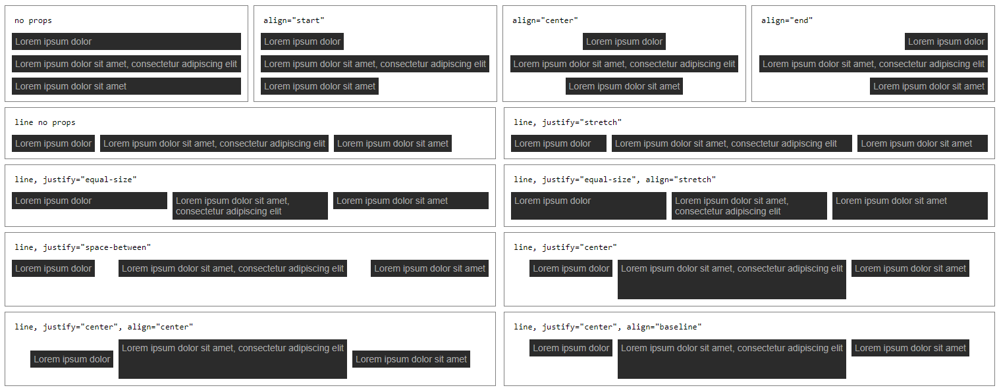

# Shimmer - Because Ruby could be more shiny!

Shimmer is a collection of Rails extensions that bring advanced UI features into your app and make your life easier as a developer.

## Features

### Components

Shimmer includes a suite of styled components that can be implemented in React and also in plain HTML or slim.

### Stack

Stack is a reusable typed component that allows you to easily manage the layout of your app. You can define whether it should be displayed horizontally, vertically, and how much spacing there should be in between the child components. This component implements a mobile-first design and allows you to customize the display and spacing even on defined breakpoints (tablet, desktop, widescreen) should you need to.

To use it in a React project, you can just import and use it as you would in a normal React component:

```js
import { Stack } from "@nerdgeschoss/shimmer/dist/components/stack";

<Stack gapTablet={4} gapDesktop={12} line>
  <div></div>
  <div></div>
  <div></div>
</Stack>;
```

To use it in an HTML file, you can just import the css file directly from `@nerdgeschoss/shimmer/dist/components/stack.css` and just implement the classes as they are in the stylesheet:

```html
<div class="stack stack--line stack--tablet-4 stack--desktop-12">
  <div></div>
  <div></div>
  <div></div>
</div>
```

#### Helper types:

```ts
type Justify =
  | "start"
  | "center"
  | "end"
  | "space-between"
  | "space-around"
  | "stretch"
  | "equal-size";
```

```ts
type Align = "start" | "center" | "end" | "stretch" | "baseline";
```



### Available props:

| Field             | Type      | Description                                                                                                                                 |
| ----------------- | --------- | ------------------------------------------------------------------------------------------------------------------------------------------- |
| gap               | `number`  | Space between elements                                                                                                                      |
| gapTablet         | `number`  | Gap size for screen starting on Tablet breakpoint                                                                                           |
| gapDesktop        | `number`  | Gap size for screen starting on Desktop breakpoint                                                                                          |
| gapWidescreen     | `number`  | Gap size for screen starting on WideScreen breakpoint                                                                                       |
| line              | `boolean` | Stacks elements horizontally                                                                                                                |
| lineTablet        | `boolean` | Stacks elements horizontally starting on Tablet breakpoint                                                                                  |
| lineDesktop       | `boolean` | Stacks elements horizontally starting on Desktop breakpoint                                                                                 |
| lineWidescreen    | `boolean` | Stacks elements horizontally starting on WideScreen breakpoint                                                                              |
| align             | `Align`   | Aligns element according to the [main axis](https://developer.mozilla.org/en-US/docs/Glossary/Main_Axis) of the flex container              |
| alignTablet       | `Align`   | Align on Tablet breakpoint                                                                                                                  |
| alignDesktop      | `Align`   | Align on Desktop breakpoint                                                                                                                 |
| alignWidescreen   | `Align`   | Align on Widescreen breakpoint                                                                                                              |
| justify           | `Justify` | Specifies how elements are distributed along [main axis](https://developer.mozilla.org/en-US/docs/Glossary/Main_Axis) of the flex container |
| justifyTablet     | `Justify` | Justify on Tablet breakpoint                                                                                                                |
| justifyDesktop    | `Justify` | Justify on Desktop breakpoint                                                                                                               |
| justifyWidescreen | `Justify` | Justify on Widescreen breakpoint                                                                                                            |

When using the CSS classes instead of react component we can generate the class names looking at the available props by using the prop names and BEM convention.

For example:

```js
<Stack gapTablet={4} gapDesktop={12} line>
  ...
</Stack>
```

would translate to

```html
<div class="stack stack--tablet-4 stack--destop-12 stack--line">...</div>
```

Pleae, note that there is not word "gap" in the class names since we use it implicitly, i.e. `gapWidescreen={12}` is equivalent to `stack stack--widescreen-12`.

Another thing to keep in mind when using CSS version of the component that the sizes are fixed - in contrary to the React one where we can add any number we want.

Here is the list of available sizes for CSS version:

```scss
$sizes: (
  0: 0px,
  2: 2px,
  4: 4px,
  8: 8px,
  12: 12px,
  16: 16px,
  20: 20px,
  22: 22px,
  24: 24px,
  32: 32px,
  40: 40px,
  48: 48px,
  56: 56px,
  64: 64px,
);
```

### Supported breakpoints:

- **Tablet**: 640px
- **Desktop**: 890px
- **Widescreen**: 1280px

### Rubocop Base Configuration

_Shimmer_ offers an opiniated _Rubocop_ base configuration. This configuration inherits itself from _StandardRB_ and aim at remaining as close to it as possible. Why not only use _StandardRB_, since it is so fast and prevent bikeshedding? Well, sadly, it does not solve all problems and using _Rubocop_ still integrates a lot easier in most toolsets. However, the idea is to still prevent bikeshedding our _Rubocop_ configuration by making sure that every exception to what's configured in _StandardRB_ is justified (with a comment over its configuration block in `./config/rubocop_base.yml`), reviewed, debated, and agreed upon before being merged.

#### Use Shared Configuration In Projects

Typically, a `.rubocop.yml` file in projects using _Shimmer_ looks like this.

```yml
inherit_gem:
  shimmer: config/rubocop_base.yml
```

Then, if there are specific cops you want to use in the specific project you are working on, you still can easily add them. But at least, the base configuration is shared between projects and is itself as close to _StandardRB_ as possible.

### Static File Serving

`ActiveStorage` is great, but serving of files, especially behind a CDN, can be complicated to get right. This can be fixed easily:

```ruby
# use an image tag
image_tag user.avatar, width: 300
```

This extension overrides `image_tag` and also supplies a matching `image_file_url` that automatically resizes your image and creates a static, cacheable url.

### Modals

Modals are the designer's best friend, but developers usually hate them for their complexity. Fear no more: Shimmer has you covered.

```slim
a href=modal_path(new_post_path) Create a new Post
```

This will open a modal on click and then asynchronously request the modal content from the controller. Modals can also be controlled via JavaScript via the global `ui` variable:

```js
ui.modal.open({ url: "/posts/new" });
ui.modal.close();
```

### Popovers

When modals are annoying to implement, popovers are even worse. Thankfully, Shimmer comes to the rescue:

```slim
a href=popover_path(new_post_path, placement: :left)
```

This will request `new_post_path` and display it left of the anchor thanks to PopperJS.

### Remote Navigation

Remote navigation takes Hotwire to the next level with built-in navigation actions, integrated with modals and popovers.

```ruby
def create
  @post = current_user.posts.create! post_params
  ui.navigate_to @post
end
```

This will automatically close the current modal or popover and navigate via Turbo Drive to the post's url - no redirects necessary.

The `ui` helper comes with several built-in functions:

```ruby
# run any kind of javascript upon request completion
ui.run_javascript("alert('hello world')")

# open or replace a modal's content (dependent on its ID)
ui.open_modal(new_post_path, size: :small)

# close an open modal
ui.close_modal

# same methods also available for popovers
ui.open_popover(new_post_path, selector: "#user-profile", placement: :left)
ui.close_popover

# navigate via Turbo Drive
ui.navigate_to(@post)

# manipulate the page's content
ui.append(@post, with: "comments/comment", comment: @comment)
ui.prepend("#user-profile", with: "users/extra")
ui.replace(@post)
ui.remove(@post)
```

### Sitemaps

Want to implement sitemaps, but the ephemeral filesystem of Heroku hates you? Here's a simple way to upload sitemaps:

- install the sitemap gem and configure the `sitemap.rb` as usual
- use the shimmer adapter to automatically upload your sitemap to your configured ActiveStorage adapter
- use the shimmer controller to display the sitemap in your app
- (optional) tell sidekiq scheduler to regularly update your sitemap

```ruby
# sitemap.rb
SitemapGenerator::Sitemap.adapter = Shimmer::SitemapAdapter.new

# routes.rb
get "sitemaps/*path", to: "shimmer/sitemaps#show"

# sidekiq.yml
:schedule:
  sitemap:
    cron: '0 0 12 * * * Europe/Berlin' # every day at 16:00, Berlin time
    class: Shimmer::SitemapJob
```

### Cloudflare Support

As you might have noticed, Cloudflare SSL will cause some issues with your Rails app if you're not using SSL strict mode (https://github.com/rails/rails/issues/22965). If you can't switch to strict mode, go for the standard flexible mode instead and add this middleware to your stack:

```ruby
# application.rb
config.middleware.use Shimmer::CloudflareProxy
```

### Heroku Database Helpers

Can't reproduce an issue with your local test data and just want the production or staging data on your development machine? Here you go:

```bash
rails db:pull
```

This will drop your local database and pull in the database of your connected Heroku app (make sure you executed `heroku git:remote -a your_app` before to have the git remote). But what about assets you might ask? Easy - assets are pulled from S3 as well via the AWS CLI automatically (make sure your environment variables in Heroku are correctly named as `AWS_REGION`, `AWS_ACCESS_KEY_ID` and `AWS_SECRET_ACCESS_KEY`) and the database is updated to use your local filesystem instead.

If you don't want the asset support, you can also only pull the database or only the assets:

```bash
rails db:pull_data
rails db:pull_assets
```

### Localizable Routes with Browser Locale Support

To localize a page via urls, this will help you tremendously.

```ruby
# routes.rb
Rails.application.routes.draw do
  scope "/(:locale)", locale: /#{I18n.available_locales.join("|")}/ do
    get "login", to: "sessions#new"
  end
end
```

From now on you can prefix your routes with a locale like `/de/login` or `/en/login` and `I18n.locale` will automatically be set. If there is no locale in the url (it's optional), this will automatically use the browser's locale.

You want to redirect from unlocalized paths? Add a before action to your controller:

```ruby
before_action :check_locale
```

Trying to figure out which key a certain translation on the page has? Append `?debug` to the url and `I18n.debug?` will be set - which leads to keys being printed on the page.

### 🍪 Cookies

Integrate cookie consent and add tracking capabilities such as Google Tag Manager and Google Analytics to your application with the following steps:

**Include Shimmer's Consent Module**: Add the following line to your `application_controller.rb`:

```ruby
class ApplicationController < ActionController::Base
  include Shimmer::Consent
end
```

**Add Google Tag Manager and Google Analytics**:

*   If you wish to include Google Tag Manager or Google Analytics, insert either of the following lines to your `application.js`:

```typescript
ui.consent.enableGoogleTagManager(GOOGLE_TAG_MANAGER_ID);
```

```typescript
ui.consent.enableGoogleAnalytics(GOOGLE_ANALYTICS_ID);
```

Replace `GOOGLE_TAG_MANAGER_ID` with your Google Tag Manager ID or `GOOGLE_ANALYTICS_ID` with your Google Analytics ID.

**User Consent**: `Shimmer::Consent` provides a [stimulus controller](src/controllers/consent.ts) for creating a cookie banner. When the 'statistic' option is submitted to the controller, the necessary tracking scripts are added to the page's head.

### Configuration

Shimmer provides a Config object which can be used to access encrypted credentials and environment variables. (YAML nesting of keys is not supported)

**Basic Usage**
Retrieve a configuration value directly using the name of the key. For example, to access the SECRET_KEY configuration:
```ruby
Config.secret_key
```

**Required Configuration Values**
Append an exclamation mark (!) to enforce the presence of a configuration key. If the key is missing, a `Shimmer::Config::MissingConfigError` is raised.
```ruby
Config.secret_key!
```

**Boolean Configuration Values**
Append a question mark (?) for boolean type coercion. This is useful for feature flags or boolean settings.
```ruby
Config.sparkle
# => "no" (or "n", "0", "false")
Config.sparkle?
# => false

Config.shimmer
# => "yes" (or anything else)
Config.shimmer?
# => true
```

**Default Values**
Specify a default value using the :default option. This value is returned when the specified key is not found in the environment or credentials.
```ruby
Config.secret_key(default: true)
```

**Stubbing Configuration in Tests**
Shimmer includes a helper module for conveniently stubbing configuration values in tests, particularly useful in RSpec.

**Example Usage:**
Stub one or multiple configuration keys using the `stub_config` method:
```ruby
stub_config secret_key: "secret_key", secret_key_2: "secret_key_2"
```
This approach allows you to simulate various configurations without altering/needing the actual environment variables or encrypted credentials.


## Installation

Add this line to your application's Gemfile:

```ruby
gem "shimmer"
```

And then execute:

```bash
$ bundle install
```

Add some configuration to your project:

```ruby
# routes.rb

resources :files, only: :show, controller: "shimmer/files"

# application_controller.rb
class ApplicationController < ActionController::Base
  include Shimmer::Localizable
  include Shimmer::RemoteNavigation
end
```

```ts
// application.ts

import { start } from "@nerdgeschoss/shimmer";
import { application } from "controllers/application";

start({ application });
```


## Testing & Demo

This library is tested using _RSpec_.

```bash
bin/rspec
```

A **system test** suite is included and is performed against a demo _Rails_ application in `spec/rails_app`. This
application can be started in development mode for "playing around" with _Shimmer_ during its development and add
more system tests. The `bin/dev` script starts that demo application.

The first time, you want to initialize the database and seed it some data.

```bash
bin/setup
```

Then you can start the development server.

```bash
bin/dev
```

## Contributing

Bug reports and pull requests are welcome on GitHub at https://github.com/nerdgeschoss/shimmer. This project is intended to be a safe, welcoming space for collaboration, and contributors are expected to adhere to the [code of conduct](https://github.com/nerdgeschoss/shimmer/blob/master/CODE_OF_CONDUCT.md).

## License

The gem is available as open source under the terms of the [MIT License](https://opensource.org/licenses/MIT).

## Code of Conduct

Everyone interacting in the Shimmer project's codebases, issue trackers, chat rooms and mailing lists is expected to follow the [code of conduct](https://github.com/nerdgeschoss/shimmer/blob/master/CODE_OF_CONDUCT.md).
